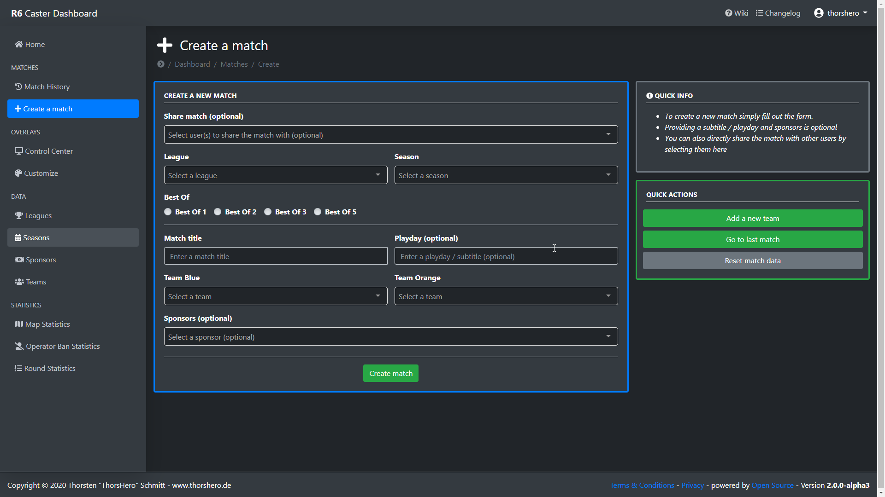
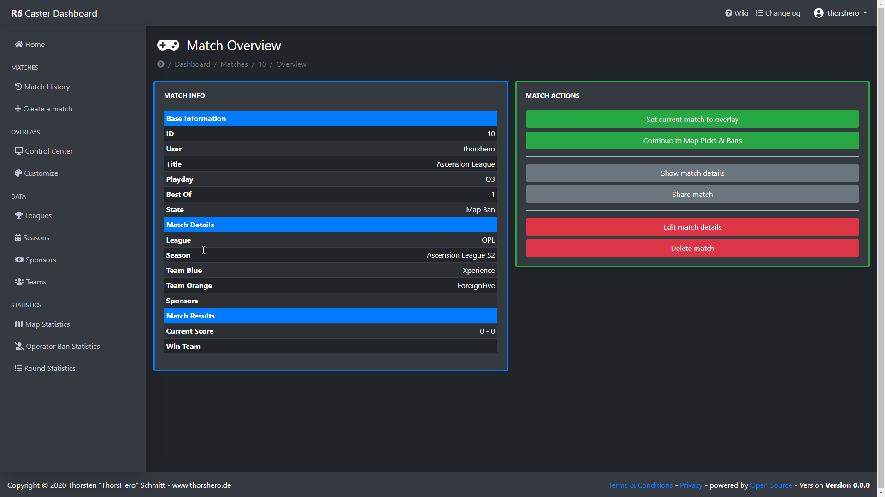
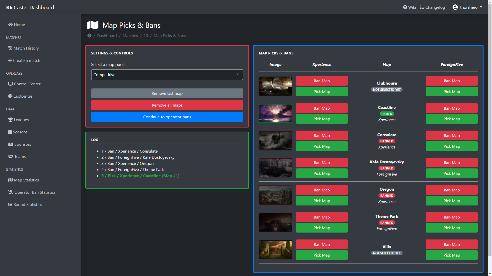
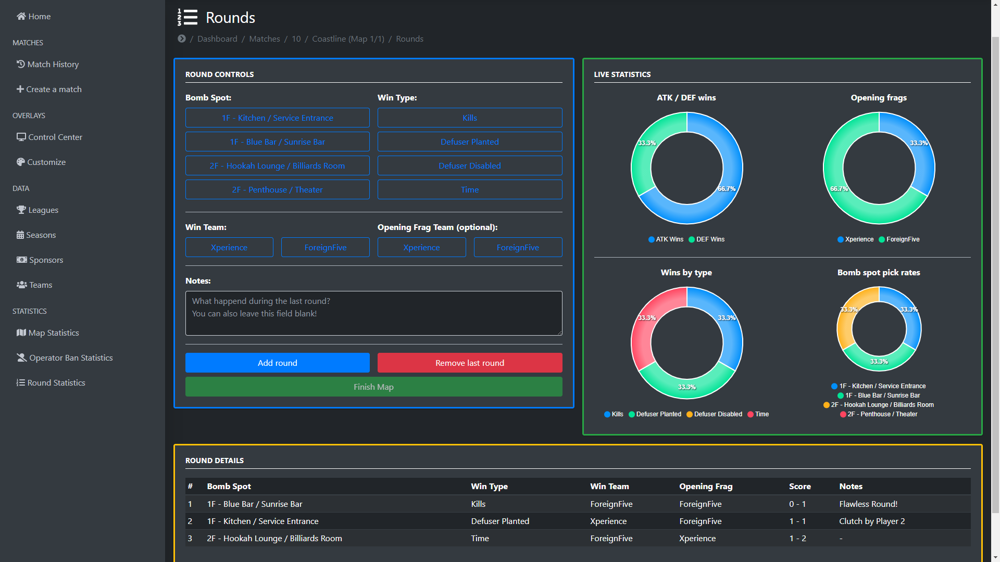
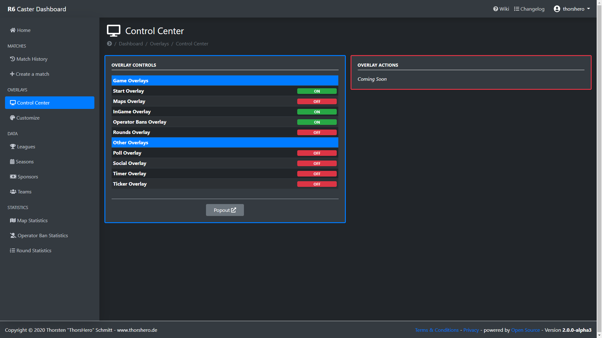
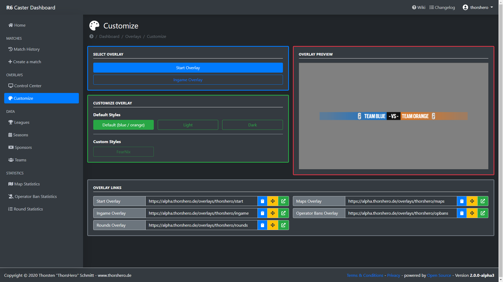

# R6 Caster Dashboard

## Description

This is the repository for the new Rainbow Six Siege Caster Dashboard.
The dashboard aims to help Casters with production by providing easy-to-use and modular Overlays and control via a web dashboard.

## Features

### Matches
- Create, view, edit, share and manage matches
- Map Picks & Bans
- Operator Bans
- Round History (BombSpot, WinTeam, Opening Frag Team, Notes, Live Statistics)   

### Data Management
- Create, view and edit Teams (and their logos)
- No need to add teams every time you want to cast or produce a match

### League Administration*

- Manage your league
- Add and edit sponsors
- Grant or revoke other users access to your league

### Statistics*

- Map pick, ban and win rates
- BombSpot pick and win rates
- Filter for a specific league, season or team

### Overlays
- Show viewers match related data with the Start, InGame, Maps, Round overlays and more
- Show your social media tags, create polls and more*
- Leagues can easily get custom overlay styles

**Coming Soon!*

## Installation

The dashboard is available as a [Docker Image](https://hub.docker.com/r/thorshero/caster-dashboard-2).

To install the complete dashboard on your machine, download the [docker-compose.yml](docker-compose.yml) file and edit it to your needs. The parts that need to be edited are documented by comments.

You **must** set a secret key for your Django instance in the `environment` section of the `dashboard` service. You can for example use the`get_random_secret_key()` function from the python package `django.core.management.utils` to generate one.

Additionally, add your the domain on which the dashboard will be accessed to the `ALLOWED_HOSTS` (you can skip that if you only run the dashboard locally). Finally, add your email address and it's server settings which is needed for users to be able to register for the dashboard (*Note: The registration is not implemented yet!*).

That's it for the installation! You can now access the dashboard's admin page via `<yourdomain.example>/admin` and login with the default username `admin` and password `caster_dashboard_2`. You may want to create users manually from there.

## Screenshots

|            |     |
| ------------------------------------------- | -------------------------------------- |
|        |             |
|  |  |

## Contributing

- If you want to help me develop the dashboard, create issues, comment, like and share the project. :heart:
- Ideas for new features, mean comments about what a mess my code is and other things are most welcome :wink:
- If you know your way around in code, feel free to submit a pull request! :floppy_disk:
- You can also get in touch with me via one of my social media channels :speech_balloon:

### Translations

If you want to help to translate the Caster Dashboard, feel free to join the [translation project](https://poeditor.com/projects/view?id=384975) over on POEditor.com [here](https://poeditor.com/join/project?hash=6hvn1jzn8o). Feel free to proofread my translation or add your own!

## Changelog

Current Version: 2.0.0-alpha3

**Note:** This release is not yet ready for production!

See the full [Changelog](CHANGELOG.md) for further information.